<div align="center">



[](https://github.com/Shivam7979s)


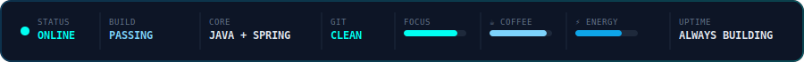


</div>

## 🧠 `AI_Dashboard.init()`

<div align="center">

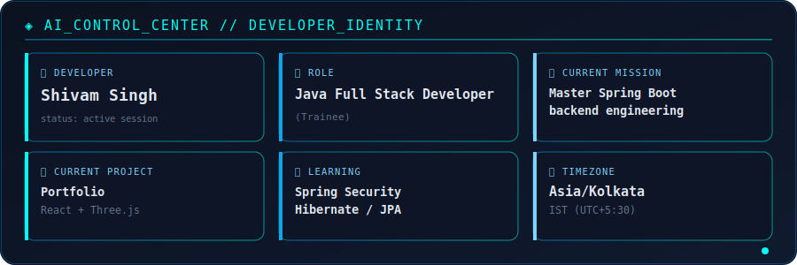


</div>

## 💻 `~/shivam — zsh`

<div align="center">
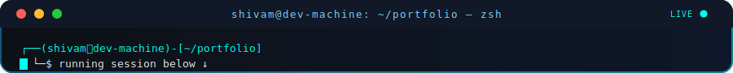
</div>

```
┌──(shivam㉿dev-machine)-[~/portfolio]
└─$ whoami
Shivam Singh

┌──(shivam㉿dev-machine)-[~/portfolio]
└─$ role
Java Full Stack Developer (in training)

┌──(shivam㉿dev-machine)-[~/portfolio]
└─$ currently_learning
Spring Boot · Spring Security · Hibernate/JPA

┌──(shivam㉿dev-machine)-[~/portfolio]
└─$ focus
Backend Engineering — building production-grade Java systems

┌──(shivam㉿dev-machine)-[~/portfolio]
└─$ java -version
openjdk version "21" — LTS, learning modern Java

┌──(shivam㉿dev-machine)-[~/portfolio]
└─$ spring --status
Spring Boot :: learning-mode :: building REST APIs

┌──(shivam㉿dev-machine)-[~/portfolio]
└─$ git status
On branch main
nothing to commit, working tree clean

┌──(shivam㉿dev-machine)-[~/portfolio]
└─$ location
India 🇮🇳

┌──(shivam㉿dev-machine)-[~/portfolio]
└─$ status
Always Building ⚡

┌──(shivam㉿dev-machine)-[~/portfolio]
└─$ █
```

<div align="center">


</div>

## 🧑‍💻 `Who_I_Am.ts`

```ts
const shivam: DeveloperProfile = {
  title: "B.Tech Computer Science Student | Aspiring Java Full Stack Developer",

  stack: {
    languages:  ["Java", "C", "SQL", "Python", "JavaScript", "TypeScript"],
    frontend:   ["HTML5", "CSS3", "React", "Tailwind CSS", "Three.js", "Framer Motion"],
    backend:    ["Spring Boot (Learning)", "Spring MVC (Learning)", "Spring Data JPA (Learning)", "REST APIs", "Node.js", "Express.js"],
    database:   ["MySQL", "PostgreSQL", "Prisma ORM"],
    cloud:      ["Railway", "Vercel"],
    devTools:   ["Git", "GitHub", "VS Code", "IntelliJ IDEA", "Maven", "Postman"],
  },

  launchedProjects: ["DSA", "Portfolio"],

  careerGoal: [
    "Java", "Spring Boot", "Spring Security", "Hibernate/JPA",
    "REST APIs", "React", "MySQL", "Data Structures and Algorithms",
    "Git and GitHub", "Docker", "Microservices", "AWS",
  ],

  currentlyLearning: "Spring Boot ecosystem — building toward production-ready backend systems",

  status:    "Currently mastering the Java Full Stack ecosystem 🚀",
  funFact:   "Ships DSA solutions in Java and 3D portfolios in React — equally comfortable in both worlds.",
  openTo:    "Not actively job hunting right now — focused on leveling up",
} as const;

export default shivam;
```

<div align="center">


</div>

## 🎯 `Current_Focus.status()`

| 🔭 Current Focus                             | 📚 Learning Roadmap                                             | 🌱 2026 Goal                                              |
| --------------------------------------------- | ---------------------------------------------------------------- | ---------------------------------------------------------- |
| Backend engineering with Java + Spring Boot   | Spring Security → Hibernate/JPA → Microservices → Docker → AWS   | Ship a full production-grade Java Full Stack application   |

| **⚙️ Development Environment**<br>Editor: IntelliJ IDEA / VS Code<br>Shell: zsh<br>OS: Windows / Linux<br>Build Tool: Maven<br>API Testing: Postman | **🧠 Coding Principles**<br>Clean code over clever code<br>Understand the data structure before the syntax<br>Ship small, ship often<br>Read the docs before the Stack Overflow answer | **🗓️ Daily Workflow**<br>Morning: DSA practice (Java)<br>Midday: Spring Boot backend build<br>Evening: React / portfolio polish<br>Night: docs + code review |
| --- | --- | --- |

> *"The obstacle is the way." — building one commit at a time.*

<div align="center">


</div>

## 🏗️ `System_Architecture.diagram()`

Target production architecture for the Java Full Stack path currently being built toward:

<div align="center">
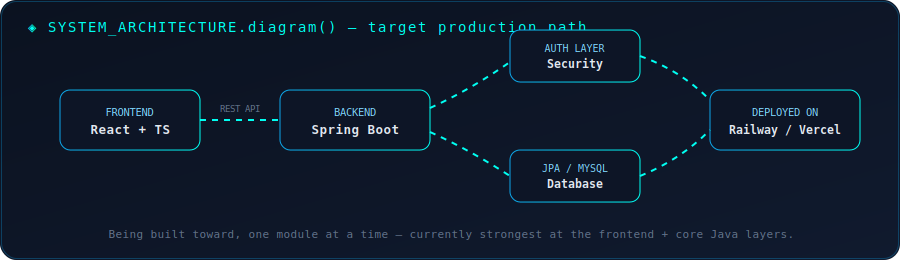
</div>

<div align="center">


</div>

## 🚀 `Featured_Projects.launch()`

### 📁 DSA


<p>

<a href="https://github.com/Shivam7979s/DSA"></a>
</p>

[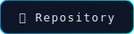](https://github.com/Shivam7979s/DSA)

### 📁 Portfolio

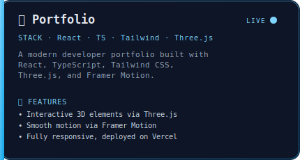

<p>

<a href="https://portfolio-ten-lime-du4ew9xj41.vercel.app/#home"></a>
</p>

[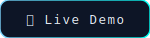](https://portfolio-ten-lime-du4ew9xj41.vercel.app/#home)
[](https://github.com/Shivam7979s/portfolio)

<div align="center">


</div>

## 🛠️ `Tech_Stack.render()`

<div align="center">

</div>

**Languages**


**Frontend**


**Backend**


**Database**


**Cloud and Deployment**


**Dev Tools**


<p>
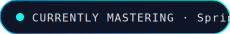

</p>

<div align="center">


</div>

## 🗺️ `Java_Full_Stack_Roadmap.plan()`

<div align="center">
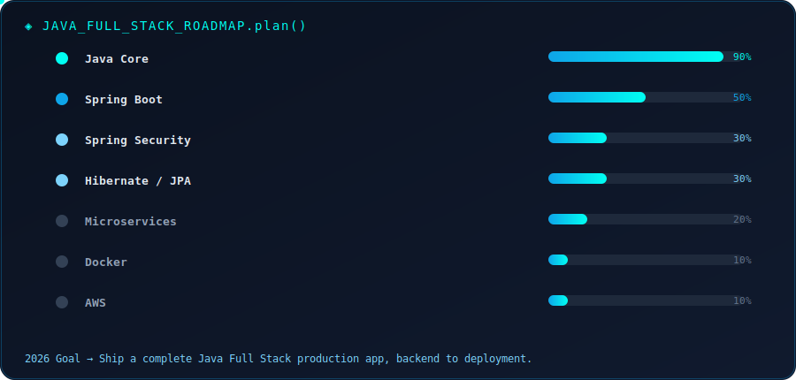
</div>

**2026 Goal →** Ship a complete Java Full Stack production app, backend to deployment.

<div align="center">


</div>

## 📊 `GitHub_Stats.exe`

<div align="center">


</div>

## 🎮 `Isometric_Activity.render3d()`

<div align="center">


> ⚡ *Live 3D isometric calendar rendered by* [`lowlighter/metrics`](https://github.com/lowlighter/metrics)

</div>

## 🏆 `Trophies.unlock()`

<div align="center">

</div>

## 📈 `Contribution_Activity.stream()`

<div align="center">

</div>

**🐍 Bonus: animated contribution snake (enable with one-time GitHub Action setup)**

<div align="center">

</div>

To activate this, add the [`platane/snk`](https://github.com/Platane/snk) GitHub Action to this repo — it generates a snake that "eats" your contribution graph and outputs it to this exact URL automatically.

<div align="center">


</div>

## 🧩 `LeetCode_Dashboard.stats()`

<div align="center">


[](https://leetcode.com/u/Shivam797904/)


</div>

## 🤝 `Connect.init()`

<div align="center">

[](https://www.linkedin.com/in/shivam-singh-367388327/)
[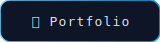](https://portfolio-ten-lime-du4ew9xj41.vercel.app/#home)
[](mailto:shivam.singh97989218@gmail.com)


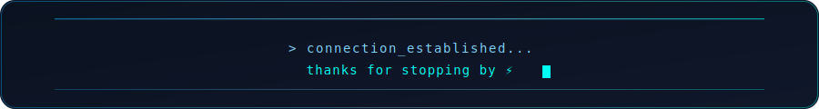

</div>
